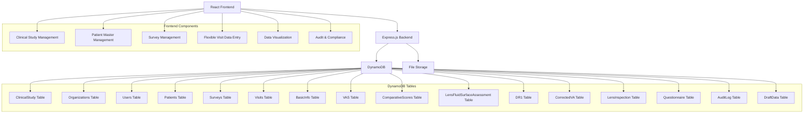
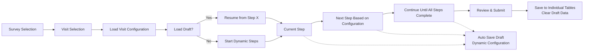

# 眼科臨床試験管理プラットフォーム Design Document

## Overview

眼科臨床試験管理プラットフォームは、眼科臨床試験における包括的なデータ収集、管理、および監査を支援するWebアプリケーションです。階層的なデータ構造（ClinicalStudy → Survey → Visit → 検査データ）により、標準化された試験実施と高品質なデータ収集を実現します。システムは患者マスター管理、柔軟なVisit構成、マルチ組織対応、完全な監査ログ機能を提供します。

## Architecture

包括的な臨床試験管理プラットフォームとして、モノリシック構成でDynamoDBを使用したコスト効率的な設計を採用します：



### Technology Stack
- **Frontend**: React 18 with TypeScript, Material-UI v5
- **Backend**: Node.js with Express.js, TypeScript
- **Database**: DynamoDB (single database solution)
- **File Storage**: Local file system (Phase 1), S3 for future phases
- **State Management**: React Context API + useReducer
- **Form Management**: React Hook Form with Zod validation
- **AWS SDK**: DynamoDB client for Node.js v3
- **Deployment**: Docker containers with docker-compose

### Key Design Principles

**階層的データ構造:**
- ClinicalStudy（臨床試験プロトコル）→ Survey（個別患者試験）→ Visit（患者訪問）→ 検査データ
- 患者マスター管理による既存患者の再利用
- 柔軟なVisit構成（Visit毎に異なる検査ステップ組み合わせ）
- Organizations・Users・AuditLogによる管理機能強化
- 各テーブルは検査グループごとに独立
- DraftDataで統合された下書き管理
- テンプレート機能による標準化された試験実施

## Data Models

### DynamoDB Table Designs

#### 1. ClinicalStudy Table (臨床試験プロトコル)
```typescript
interface ClinicalStudyRecord {
  // Partition Key
  clinicalStudyId: string; // "study-{studyCode}-{timestamp}"
  
  // Study Information
  studyName: string; // 試験名
  studyCode: string; // 試験コード
  description: string; // 試験説明
  
  // Timeline
  startDate: string; // 開始日 (ISO string)
  endDate: string; // 終了日 (ISO string)
  
  // Participating Organizations
  targetOrganizations: string[]; // 対象組織IDリスト
  maxPatientsPerOrganization: number; // 組織あたりの最大患者数
  totalTargetPatients: number; // 全体の目標患者数
  
  // Visit Configuration Template
  visitTemplate: {
    visitNumber: number; // 訪問番号
    visitType: 'baseline' | '1week' | '1month' | '3month' | 'custom'; // 訪問タイプ
    visitName: string; // 訪問名（例: "ベースライン訪問"）
    scheduledDaysFromBaseline: number; // baselineからの予定日数
    windowDaysBefore: number; // 許容範囲（前）
    windowDaysAfter: number; // 許容範囲（後）
    requiredExaminations: string[]; // 必須検査項目
    optionalExaminations: string[]; // 任意検査項目
    examinationOrder: string[]; // 検査実施順序
    isRequired: boolean; // 必須訪問かどうか
  }[];
  
  // Study Configuration
  examinations: {
    examinationId: string; // 検査ID
    examinationName: string; // 検査名
    description: string; // 検査説明
    isRequired: boolean; // 必須検査かどうか
    estimatedDuration: number; // 予想所要時間（分）
  }[];
  
  // Study Status and Progress
  status: 'planning' | 'active' | 'recruiting' | 'completed' | 'suspended' | 'terminated';
  currentPhase: string; // 現在のフェーズ
  enrolledPatients: number; // 登録済み患者数
  
  // Regulatory Information
  protocolVersion: string; // プロトコルバージョン
  ethicsApprovalNumber?: string; // 倫理委員会承認番号
  regulatoryApprovals: string[]; // 規制当局承認リスト
  
  // Metadata
  createdBy: string; // 作成者
  lastModifiedBy: string; // 最終更新者
  createdAt: string; // ISO string
  updatedAt: string; // ISO string
  
  // GSI for listing studies by status
  entityType: 'clinical-study'; // GSI partition key
}
```

#### 2. Organizations Table (組織管理)
```typescript
interface OrganizationRecord {
  // Partition Key
  organizationId: string; // "org-{orgCode}-{timestamp}"
  
  // Organization Information
  organizationName: string; // 組織名
  organizationCode: string; // 組織コード
  organizationType: 'hospital' | 'clinic' | 'research_center' | 'university' | 'other';
  
  // Contact Information
  address: {
    country: string;
    prefecture: string; // 都道府県
    city: string;
    addressLine1: string;
    addressLine2?: string;
    postalCode: string;
  };
  
  phoneNumber: string;
  email: string;
  website?: string;
  
  // Organization Personnel
  principalInvestigator: string; // 主任研究者
  studyCoordinator: string; // 研究コーディネーター
  contactPerson: string; // 連絡担当者
  
  // Capabilities
  maxPatientCapacity: number; // 最大患者受け入れ数
  availableEquipment: string[]; // 利用可能機器リスト
  certifications: string[]; // 認証・資格リスト
  
  // Status
  status: 'active' | 'inactive' | 'pending_approval' | 'suspended';
  approvalDate?: string; // 承認日
  
  // Participating Studies
  activeStudies: string[]; // 参加中の臨床試験IDリスト
  
  // Metadata
  createdBy: string;
  lastModifiedBy: string;
  createdAt: string;
  updatedAt: string;
  
  // GSI for listing organizations by status
  entityType: 'organization'; // GSI partition key
}
```

#### 3. Users Table (ユーザー管理)
```typescript
interface UserRecord {
  // Partition Key
  userId: string; // "user-{username}-{timestamp}"
  
  // User Identity
  username: string; // ユーザー名（ログイン用）
  email: string; // メールアドレス
  
  // Personal Information
  firstName: string; // 名
  lastName: string; // 姓
  displayName: string; // 表示名
  
  // Professional Information
  title: string; // 職位
  department?: string; // 部署
  specialization?: string; // 専門分野
  licenseNumber?: string; // 医師免許番号等
  
  // Organization Association
  primaryOrganizationId: string; // 主所属組織
  accessibleOrganizations: string[]; // アクセス可能組織リスト
  
  // Role and Permissions
  role: 'super_admin' | 'study_admin' | 'org_admin' | 'investigator' | 'coordinator' | 'data_entry' | 'viewer';
  permissions: string[]; // 詳細権限リスト
  
  // Study Access
  accessibleStudies: string[]; // アクセス可能な臨床試験IDリスト
  
  // Account Status
  status: 'active' | 'inactive' | 'pending_activation' | 'suspended' | 'locked';
  lastLoginAt?: string; // 最終ログイン日時
  passwordChangedAt: string; // パスワード変更日時
  failedLoginAttempts: number; // ログイン失敗回数
  
  // Security
  passwordHash: string; // パスワードハッシュ
  mfaEnabled: boolean; // 多要素認証有効フラグ
  mfaSecret?: string; // MFA秘密鍵
  
  // Preferences
  language: 'ja' | 'en'; // 言語設定
  timezone: string; // タイムゾーン
  
  // Metadata
  createdBy: string;
  lastModifiedBy: string;
  createdAt: string;
  updatedAt: string;
  
  // GSI for login
  entityType: 'user'; // GSI partition key
}
```

#### 4. Patients Table (患者マスター)
```typescript
interface PatientRecord {
  // Partition Key
  patientId: string; // "patient-{patientCode}-{timestamp}"
  
  // Patient Identity (Anonymized)
  patientCode: string; // 患者コード（匿名化済み）
  patientInitials?: string; // 患者イニシャル
  
  // Demographics
  dateOfBirth?: string; // 生年月日（匿名化レベルに応じて）
  gender?: 'male' | 'female' | 'other';
  
  // Registration Information
  registeredOrganizationId: string; // 登録組織ID
  registrationDate: string; // 登録日
  
  // Medical Information
  medicalHistory?: string[]; // 既往歴
  currentMedications?: string[]; // 現在の服薬
  allergies?: string[]; // アレルギー情報
  
  // Contact Information (if applicable)
  contactInfo?: {
    phone?: string;
    email?: string;
    emergencyContact?: string;
  };
  
  // Status
  status: 'active' | 'inactive' | 'withdrawn' | 'completed';
  
  // Participating Studies
  participatingStudies: string[]; // 参加中の臨床試験IDリスト
  
  // Metadata
  createdBy: string;
  lastModifiedBy: string;
  createdAt: string;
  updatedAt: string;
  
  // GSI for organization-based queries
  entityType: 'patient'; // GSI partition key
}
```

#### 5. Surveys Table (個別患者試験管理)
```typescript
interface SurveyRecord {
  // Partition Key
  surveyId: string; // "survey-{patientId}-{studyId}-{timestamp}"
  
  // Clinical Study Reference
  clinicalStudyId: string; // 所属する臨床試験
  organizationId: string; // 実施組織ID
  
  // Patient Information
  patientId: string; // 患者ID（患者マスターへの参照）
  
  // Survey Metadata
  name: string; // サーベイ名（例: "患者001-ベースライン"）
  description?: string;
  
  // Timeline
  baselineDate: string; // ベースライン日 (ISO string)
  expectedCompletionDate: string; // 予想完了日
  
  // Status and Progress
  status: 'active' | 'completed' | 'withdrawn' | 'suspended';
  completionPercentage: number; // 完了率（0-100）
  
  // Visit Management
  totalVisits: number; // 総Visit数
  completedVisits: number; // 完了済みVisit数
  
  // Metadata
  assignedBy: string; // 割り当て者
  conductedBy?: string; // 実施者
  createdAt: string;
  updatedAt: string;
  
  // GSI for organization and study queries
  entityType: 'survey'; // GSI partition key
}
```

#### 6. Visits Table (患者訪問管理)
```typescript
interface VisitRecord {
  // Partition Key
  surveyId: string;
  // Sort Key  
  visitId: string; // "visit-{visitNumber}-{timestamp}"
  
  // Clinical Study Reference
  clinicalStudyId: string; // 所属する臨床試験
  organizationId: string; // 実施組織ID
  patientId: string; // 患者ID
  
  // Visit Configuration
  visitNumber: number; // 訪問番号
  visitType: 'baseline' | '1week' | '1month' | '3month' | 'custom'; // 訪問タイプ
  visitName: string; // 訪問名
  
  // Scheduling
  scheduledDate: string; // 予定日 (ISO string)
  actualDate?: string; // 実際の実施日
  windowStartDate: string; // 許容開始日
  windowEndDate: string; // 許容終了日
  
  // Visit Status
  status: 'scheduled' | 'in_progress' | 'completed' | 'missed' | 'cancelled' | 'rescheduled';
  completionPercentage: number; // 完了率（0-100）
  
  // Flexible Examination Configuration
  requiredExaminations: string[]; // 必須検査リスト
  optionalExaminations: string[]; // 任意検査リスト
  examinationOrder: string[]; // 検査実施順序
  completedExaminations: string[]; // 完了済み検査リスト
  skippedExaminations: string[]; // スキップされた検査リスト
  
  // Visit Notes
  visitNotes?: string; // 訪問メモ
  deviationReason?: string; // プロトコル逸脱理由
  
  // Personnel
  conductedBy: string; // 実施者ID
  
  // Metadata
  createdAt: string;
  updatedAt: string;
}
```
###
# 7. BasicInfo Table (基礎情報)
```typescript
interface BasicInfoRecord {
  // Partition Key
  visitId: string;
  // Sort Key
  basicInfoId: string; // "basicinfo-{eyeSide}-{timestamp}"
  
  // Basic Information Data
  currentUsedCL: string; // 現在使用しているコンタクトレンズ
  
  // 角膜曲率半径
  cr_R1: number; // Integer
  cr_R2: number; // Integer
  cr_Ave: number; // Integer - 平均
  
  // 屈折検査
  va: number; // Float - 視力
  s: number; // Float - 球面度数
  c: number; // Float - 円柱度数
  ax: number; // Integer - 軸
  
  // 眼圧
  intraocularPressure1: number; // Integer
  intraocularPressure2: number; // Integer
  intraocularPressure3: number; // Integer
  
  // 角膜内皮細胞
  cornealEndothelialCells: number; // Integer
  
  // Metadata
  eyeside: 'Right' | 'Left'; // 統一された眼側表記（自動入力）
  clinicalStudyId: string;
  organizationId: string;
  patientId: string;
  surveyId: string; // 自動入力
  createdAt: string;
  updatedAt: string;
}
```

#### 8. VAS Table (Visual Analog Scale)
```typescript
interface VASRecord {
  // Partition Key
  visitId: string;
  // Sort Key
  vasId: string; // "vas-{eyeSide}-{timestamp}"
  
  // VAS Data
  comfortLevel: number; // Integer (0-100)
  drynessLevel: number; // Integer (0-100)
  visualPerformance_Daytime: number; // Integer (0-100)
  visualPerformance_EndOfDay: number; // Integer (0-100)
  
  // Metadata
  eyeside: 'Right' | 'Left'; // 統一された眼側表記（自動入力）
  clinicalStudyId: string;
  organizationId: string;
  patientId: string;
  surveyId: string; // 自動入力
  createdAt: string;
  updatedAt: string;
}
```

#### 9. ComparativeScores Table (相対評価)
```typescript
interface ComparativeScoresRecord {
  // Partition Key
  visitId: string;
  // Sort Key
  comparativeScoresId: string; // "comparative-{eyeSide}-{timestamp}"
  
  // Comparative Assessment Data
  comfort: string;
  comfortReason: string;
  dryness: string;
  drynessReason: string;
  
  // Visual Performance
  vp_DigitalDevice: string;
  vpReason_DigitalDevice: string;
  vp_DayTime: string;
  vpReason_DayTime: string;
  vp_EndOfDay: string;
  vpReason_EndOfDay: string;
  vp_Glare: string;
  vpReason_Glare: string;
  vp_Halo: string;
  vpReason_Halo: string;
  vp_StarBurst: string;
  vpReason_StarBurst: string;
  
  // Overall Assessment
  eyeStrain: string;
  eyeStrainReason: string;
  totalSatisfaction: string;
  totalSatisfactionReason: string;
  
  // Metadata
  eyeSide: string; // 'right' | 'left'
  clinicalStudyId: string;
  organizationId: string;
  patientId: string;
  surveyId: string;
  createdAt: string;
  updatedAt: string;
}
```

#### 10. LensFluidSurfaceAssessment Table (フィッティング検査・涙濡れ性検査)
```typescript
interface LensFluidSurfaceAssessmentRecord {
  // Partition Key
  visitId: string;
  // Sort Key
  fittingId: string; // "fitting-{eyeSide}-{timestamp}"
  
  // Fitting Assessment Data
  timing: string;
  lensMovement: number; // Float
  lensPosition: string;
  fittingPattern: string;
  lensWettability: string;
  surfaceDeposit: string;
  lensDryness: string;
  
  // FACE2 Assessment
  face2_X: number; // Float
  face2_Y: number; // Float
  
  // Metadata
  eyeSide: string; // 'right' | 'left'
  clinicalStudyId: string;
  organizationId: string;
  patientId: string;
  surveyId: string;
  createdAt: string;
  updatedAt: string;
}
```

#### 11. DR1 Table (涙液層検査)
```typescript
interface DR1Record {
  // Partition Key
  visitId: string;
  // Sort Key
  dr1Id: string; // "dr1-{eyeSide}-{timestamp}"
  
  // Tear Film Assessment Data
  tearBreakUpTime: number; // Float - 涙液破綻時間
  schirmerTest: number; // Integer - シルマーテスト値
  tearMeniscusHeight: number; // Float - 涙液メニスカス高
  
  // Additional Assessments
  tearQuality: string; // 涙液の質的評価
  blinkingPattern: string; // 瞬目パターン
  
  // Metadata
  eyeSide: string; // 'right' | 'left'
  clinicalStudyId: string;
  organizationId: string;
  patientId: string;
  surveyId: string;
  createdAt: string;
  updatedAt: string;
}
```

#### 12. CorrectedVA Table (矯正視力検査)
```typescript
interface CorrectedVARecord {
  // Partition Key
  visitId: string;
  // Sort Key
  correctedVAId: string; // "correctedva-{eyeSide}-{timestamp}"
  
  // Visual Acuity Data
  va_WithoutLens: string; // レンズなし視力
  va_WithLens: string; // レンズ装用時視力
  
  // Red-Green Test
  redGreenTest: string; // 赤緑テスト
  
  // S-Correction (球面度数補正)
  va_S_Correction: string; // S補正後視力
  s_S_Correction: string; // S補正値
  clarity_S_Correction: string; // S補正後明瞭度
  clarityDetail_S_Correction: string; // S補正後明瞭度詳細
  stability_S_Correction: string; // S補正後安定性
  stabilityDetail_S_Correction: string; // S補正後安定性詳細
  
  // SC-Correction (球面円柱度数補正)
  va_SC_Correction: string; // SC補正後視力
  s_SC_Correction: string; // SC補正球面度数
  c_SC_Correction: string; // SC補正円柱度数
  ax_SC_Correction: string; // SC補正軸
  clarity_SC_Correction: string; // SC補正後明瞭度
  clarityDetail_SC_Correction: string; // SC補正後明瞭度詳細
  stability_SC_Correction: string; // SC補正後安定性
  stabilityDetail_SC_Correction: string; // SC補正後安定性詳細
  
  // Metadata
  eyeSide: string; // 'right' | 'left'
  clinicalStudyId: string;
  organizationId: string;
  patientId: string;
  surveyId: string;
  createdAt: string;
  updatedAt: string;
}
```

#### 13. LensInspection Table (レンズ検査)
```typescript
interface LensInspectionRecord {
  // Partition Key
  visitId: string;
  // Sort Key
  lensInspectionId: string; // "lensinspection-{eyeSide}-{timestamp}"
  
  // Lens Inspection Data
  lensDeposit: string; // レンズ汚れ
  lensScratchDamage: string; // レンズ傷・損傷
  
  // Metadata
  eyeSide: string; // 'right' | 'left'
  clinicalStudyId: string;
  organizationId: string;
  patientId: string;
  surveyId: string;
  createdAt: string;
  updatedAt: string;
}
```

#### 14. Questionnaire Table (問診)
```typescript
interface QuestionnaireRecord {
  // Partition Key
  visitId: string;
  // Sort Key
  questionnaireId: string; // "questionnaire-{eyeSide}-{timestamp}"
  
  // Basic Information
  timing: string; // タイミング
  
  // Comfort Assessment (時間帯別)
  comfort: string; // 全体的な快適性
  comfortDetail: string; // 快適性詳細
  comfort_Initial: string; // 装用直後の快適性
  comfortDetail_Initial: string; // 装用直後の快適性詳細
  comfort_Daytime: string; // 日中の快適性
  comfortDetail_Daytime: string; // 日中の快適性詳細
  comfort_Afternoon: string; // 午後の快適性
  comfortDetail_Afternoon: string; // 午後の快適性詳細
  comfort_EndOfDay: string; // 一日の終わりの快適性
  comfortDetail_EndOfDay: string; // 一日の終わりの快適性詳細
  
  // Dryness Assessment (時間帯別)
  dryness: string; // 全体的な乾燥感
  drynessDetail: string; // 乾燥感詳細
  dryness_Initial: string; // 装用直後の乾燥感
  drynessDetail_Initial: string; // 装用直後の乾燥感詳細
  dryness_Daytime: string; // 日中の乾燥感
  drynessDetail_Daytime: string; // 日中の乾燥感詳細
  dryness_Afternoon: string; // 午後の乾燥感
  drynessDetail_Afternoon: string; // 午後の乾燥感詳細
  dryness_EndOfDay: string; // 一日の終わりの乾燥感
  drynessDetail_EndOfDay: string; // 一日の終わりの乾燥感詳細
  
  // Symptom Assessment
  irritation: string; // 刺激感
  irritationDetail: string; // 刺激感詳細
  burning: string; // 灼熱感
  burningDetail: string; // 灼熱感詳細
  
  // Lens Handling
  easeOfInsertion: string; // 装用のしやすさ
  easeOfInsertionDetail: string; // 装用のしやすさ詳細
  easeOfRemoval: string; // 取り外しのしやすさ
  easeOfRemovalDetail: string; // 取り外しのしやすさ詳細
  
  // Visual Performance
  visualPerformance: string; // 視覚性能
  visualPerformanceDetail: string; // 視覚性能詳細
  
  // Overall Assessment
  eyeStrain: string; // 眼精疲労
  eyeStrainDetail: string; // 眼精疲労詳細
  totalSatisfaction: string; // 総合満足度
  totalSatisfactionDetail: string; // 総合満足度詳細
  
  // Other Symptoms
  otherSymptoms: string; // その他の症状
  otherSymptomsDetail: string; // その他の症状詳細
  
  // Metadata
  eyeSide: string; // 'right' | 'left'
  clinicalStudyId: string;
  organizationId: string;
  patientId: string;
  surveyId: string;
  createdAt: string;
  updatedAt: string;
}
```

#### 15. AuditLog Table (監査ログ)
```typescript
interface AuditLogRecord {
  // Partition Key
  logId: string; // "log-{timestamp}-{uuid}"
  // Sort Key
  timestamp: string; // ISO string for chronological ordering
  
  // Event Information
  eventType: 'create' | 'update' | 'delete' | 'view' | 'login' | 'logout' | 'export' | 'import';
  action: string; // 具体的なアクション（例: "survey_created", "visit_completed"）
  
  // User Information
  userId: string; // 実行者ID
  username: string; // 実行者ユーザー名
  userRole: string; // 実行者ロール
  
  // Target Information
  targetType: 'clinical_study' | 'survey' | 'visit' | 'examination' | 'user' | 'organization' | 'patient';
  targetId: string; // 対象のID
  targetName?: string; // 対象の名前
  
  // Context Information
  clinicalStudyId?: string; // 関連する臨床試験ID
  organizationId?: string; // 関連する組織ID
  patientId?: string; // 関連する患者ID
  surveyId?: string; // 関連するサーベイID
  visitId?: string; // 関連する訪問ID
  
  // Change Details
  changes?: {
    field: string;
    oldValue: any;
    newValue: any;
  }[]; // 変更内容の詳細
  
  // System Information
  ipAddress: string; // IPアドレス
  userAgent: string; // ユーザーエージェント
  sessionId: string; // セッションID
  
  // Additional Context
  description?: string; // 追加説明
  severity: 'low' | 'medium' | 'high' | 'critical'; // 重要度
  
  // Metadata
  createdAt: string; // ISO string
  
  // GSI for querying by user, target, or study
  entityType: 'audit-log'; // GSI partition key
}
```

#### 16. DraftData Table (統合下書き管理)
```typescript
interface DraftRecord {
  // Partition Key
  visitId: string;
  // Sort Key
  draftId: 'current'; // 固定値（常に最新の下書き）
  
  // 柔軟な検査グループの下書きデータを統合
  formData: {
    [examinationId: string]: {
      right?: any; // 右目のデータ
      left?: any; // 左目のデータ
    };
  };
  
  // フォーム進捗管理（柔軟な構成に対応）
  currentStep: number; // 現在のステップ
  totalSteps: number; // 総ステップ数
  completedSteps: string[]; // 完了済み検査ID
  examinationOrder: string[]; // このVisitの検査順序
  
  // Metadata
  lastSaved: string;
  autoSaved: boolean;
  
  // TTL for automatic cleanup
  ttl: number; // Unix timestamp (30 days from creation)
}
```

## Database Access Layer

### Repository Pattern Implementation
```typescript
import { DynamoDBClient } from '@aws-sdk/client-dynamodb';
import { DynamoDBDocumentClient, PutCommand, GetCommand, QueryCommand, UpdateCommand, BatchWriteCommand } from '@aws-sdk/lib-dynamodb';

class DynamoDBRepository {
  protected docClient: DynamoDBDocumentClient;
  
  constructor() {
    const client = new DynamoDBClient({
      region: process.env.AWS_REGION || 'ap-northeast-1'
    });
    this.docClient = DynamoDBDocumentClient.from(client);
  }
}

class ClinicalStudyRepository extends DynamoDBRepository {
  async save(data: Partial<ClinicalStudyRecord>): Promise<ClinicalStudyRecord> {
    const record: ClinicalStudyRecord = {
      clinicalStudyId: `study-${data.studyCode}-${Date.now()}`,
      ...data,
      createdAt: new Date().toISOString(),
      updatedAt: new Date().toISOString(),
      entityType: 'clinical-study'
    } as ClinicalStudyRecord;
    
    await this.docClient.send(new PutCommand({
      TableName: 'ClinicalStudy',
      Item: record
    }));
    
    return record;
  }
  
  async findById(clinicalStudyId: string): Promise<ClinicalStudyRecord | null> {
    const result = await this.docClient.send(new GetCommand({
      TableName: 'ClinicalStudy',
      Key: { clinicalStudyId }
    }));
    
    return result.Item as ClinicalStudyRecord || null;
  }
}

class OrganizationRepository extends DynamoDBRepository {
  async save(data: Partial<OrganizationRecord>): Promise<OrganizationRecord> {
    const record: OrganizationRecord = {
      organizationId: `org-${data.organizationCode}-${Date.now()}`,
      ...data,
      createdAt: new Date().toISOString(),
      updatedAt: new Date().toISOString(),
      entityType: 'organization'
    } as OrganizationRecord;
    
    await this.docClient.send(new PutCommand({
      TableName: 'Organizations',
      Item: record
    }));
    
    return record;
  }
}

class PatientRepository extends DynamoDBRepository {
  async save(data: Partial<PatientRecord>): Promise<PatientRecord> {
    const record: PatientRecord = {
      patientId: `patient-${data.patientCode}-${Date.now()}`,
      ...data,
      createdAt: new Date().toISOString(),
      updatedAt: new Date().toISOString(),
      entityType: 'patient'
    } as PatientRecord;
    
    await this.docClient.send(new PutCommand({
      TableName: 'Patients',
      Item: record
    }));
    
    return record;
  }
  
  async findByOrganization(organizationId: string): Promise<PatientRecord[]> {
    const result = await this.docClient.send(new QueryCommand({
      TableName: 'Patients',
      IndexName: 'OrganizationIndex',
      KeyConditionExpression: 'registeredOrganizationId = :orgId',
      ExpressionAttributeValues: {
        ':orgId': organizationId
      }
    }));
    
    return result.Items as PatientRecord[];
  }
}

class DraftDataRepository extends DynamoDBRepository {
  async saveDraft(visitId: string, formData: any, currentStep: number, totalSteps: number, completedSteps: string[], examinationOrder: string[]): Promise<void> {
    const draftRecord: DraftRecord = {
      visitId,
      draftId: 'current',
      formData,
      currentStep,
      totalSteps,
      completedSteps,
      examinationOrder,
      lastSaved: new Date().toISOString(),
      autoSaved: true,
      ttl: Math.floor(Date.now() / 1000) + (30 * 24 * 60 * 60) // 30 days
    };
    
    await this.docClient.send(new PutCommand({
      TableName: 'DraftData',
      Item: draftRecord
    }));
  }
  
  async getDraft(visitId: string): Promise<DraftRecord | null> {
    const result = await this.docClient.send(new GetCommand({
      TableName: 'DraftData',
      Key: {
        visitId,
        draftId: 'current'
      }
    }));
    
    return result.Item as DraftRecord || null;
  }
}
```

## User Interface Design

### Dynamic Visit Configuration

臨床試験作成画面では、研究責任者が柔軟にVisit構成を設定できるインターフェースを提供します：

- **デフォルト構成**: 2つのVisit（ベースライン、1週間後フォローアップ）
- **Visit管理**: 追加・削除機能（最低1つのVisit必須）
- **検査項目選択**: 8種類の検査項目からチェックボックスで選択
- **リアルタイムプレビュー**: 選択済み項目をChipで視覚化

### 左右眼並列データ入力

動的検査データ入力画面では、効率的なデータ入力のため左右眼を並列配置します：

```
┌─────────────────┬─────────────────┐
│   右目 (Right)   │   左目 (Left)    │
├─────────────────┼─────────────────┤
│ Eyeside: "Right"│ Eyeside: "Left" │
│ SurveyId: auto  │ SurveyId: auto  │
│ VisitId: auto   │ VisitId: auto   │
├─────────────────┼─────────────────┤
│ [検査フォーム]    │ [検査フォーム]    │
│                 │                 │
└─────────────────┴─────────────────┘
```

**設計原則:**
- 左右眼データを同時に入力可能
- 自動フィールド入力（Eyeside, SurveyId, VisitId）
- Visit構成に基づく動的フォーム生成
- 視覚的な区別（色分け、アイコン）

## Components and Interfaces

### 1. Clinical Study Management Component
- **Purpose**: 臨床試験プロトコルの作成、管理、テンプレート機能
- **Key Features**: 試験設計、組織管理、Visit テンプレート設定、患者登録管理
- **Data Storage**: DynamoDB ClinicalStudy Table
- **API Endpoints**:
  - `POST /api/clinical-studies` - 新規臨床試験作成
  - `GET /api/clinical-studies` - 臨床試験一覧取得
  - `GET /api/clinical-studies/:id` - 特定臨床試験詳細取得
  - `PUT /api/clinical-studies/:id` - 臨床試験更新
  - `POST /api/clinical-studies/:id/surveys` - テンプレートからSurvey作成

### 2. Organization Management Component
- **Purpose**: 組織情報管理、認証・認可、ロール管理
- **Key Features**: 組織登録、権限管理、ユーザー管理
- **Data Storage**: DynamoDB Organizations Table, Users Table
- **API Endpoints**:
  - `POST /api/organizations` - 新規組織作成
  - `GET /api/organizations` - 組織一覧取得
  - `GET /api/organizations/:id` - 特定組織詳細取得
  - `PUT /api/organizations/:id` - 組織情報更新
  - `POST /api/organizations/:id/users` - 組織ユーザー追加

### 3. Patient Master Management Component
- **Purpose**: 患者マスター管理、既存患者の検索・選択
- **Key Features**: 患者登録、検索、サーベイ割り当て
- **Data Storage**: DynamoDB Patients Table
- **API Endpoints**:
  - `POST /api/patients` - 新規患者登録
  - `GET /api/patients` - 患者一覧取得（組織別）
  - `GET /api/patients/:id` - 特定患者詳細取得
  - `PUT /api/patients/:id` - 患者情報更新
  - `POST /api/patients/:id/assign-survey` - 既存患者をサーベイに割り当て

### 4. Survey Management Component
- **Purpose**: 個別患者のサーベイ管理、進捗追跡
- **Key Features**: 患者別サーベイ管理、Visit進捗追跡、完了率管理
- **Data Storage**: DynamoDB Surveys Table
- **API Endpoints**:
  - `GET /api/clinical-studies/:studyId/surveys` - 臨床試験別サーベイ一覧
  - `GET /api/surveys/:id` - 特定サーベイ詳細取得
  - `PUT /api/surveys/:id` - サーベイ更新
  - `PUT /api/surveys/:id/status` - サーベイステータス更新

### 5. Flexible Visit Management Component
- **Purpose**: 柔軟なVisit構成管理、プロトコル準拠チェック
- **Key Features**: Visit別検査構成、動的ステップ管理、プロトコル逸脱管理
- **Data Storage**: DynamoDB Visits Table
- **API Endpoints**:
  - `GET /api/surveys/:surveyId/visits` - Visit一覧取得
  - `GET /api/visits/:id` - 特定Visit詳細取得
  - `PUT /api/visits/:id/status` - Visitステータス更新
  - `PUT /api/visits/:id/examinations` - 検査完了状況更新
  - `GET /api/visits/:id/configuration` - Visit別検査構成取得

### 6. Dynamic Examination Data Entry Component
- **Purpose**: Visit構成に応じた動的な検査データ入力
- **Key Features**: 柔軟なステップ構成、動的フォーム生成、統合下書き管理
- **Data Storage**: 各検査テーブル + DraftData Table
- **API Endpoints**:
  - `GET /api/visits/:visitId/examinations/config` - Visit別検査構成取得
  - `POST /api/visits/:visitId/examinations/:examinationId` - 検査データ保存
  - `GET /api/visits/:visitId/examinations` - 全検査データ取得
  - `POST /api/visits/:visitId/draft` - 柔軟な下書き保存
  - `GET /api/visits/:visitId/draft` - 下書き取得

## User Experience Design

### Flexible Multi-step Form Flow with Dynamic Configuration


### Key UX Features
- **Dynamic Step Configuration**: Visit毎に異なる検査ステップ組み合わせ
- **Flexible Examination Order**: プロトコルに応じた検査順序の変更
- **Left/Right Eye Management**: 各ステップで左右の目のデータを個別管理
- **Smart Draft Management**: 動的構成に対応した統合下書きデータ管理
- **Progressive Disclosure**: Visit構成に応じた関連検査項目のみ表示
- **Visual Progress Indicator**: 動的ステップ数に対応した進捗表示
- **Contextual Help**: 各検査項目に説明とガイダンスを提供
- **Patient Master Integration**: 既存患者の検索・選択・割り当て機能

## Cost Optimization Strategy

### DynamoDB Cost Management
- **On-Demand Billing**: 開発・テスト段階での予測可能なコスト
- **Efficient Key Design**: 
  - 各テーブル: visitId + 固有ID で効率的なアクセス
  - DraftData: visitId + 'current' で単純なアクセス
  - Patients: organizationId でのGSI検索
- **TTL設定**: 下書きデータの自動削除でストレージコスト削減
- **Batch Operations**: 左右の目のデータ一括保存でコスト削減

### Query Optimization
- **Visit-based Access**: visitId をパーティションキーとして効率的なデータ取得
- **Organization-based Patient Search**: GSIを使用した効率的な患者検索
- **Eye-side Separation**: 左右の目のデータを個別レコードで管理
- **Dynamic Draft Consolidation**: 1つのレコードで柔軟な下書きデータを管理

## Testing Strategy

### Database Testing
- **DynamoDB Local**: ローカル開発とテスト用
- **Test Data Fixtures**: 各検査テーブルの現実的なテストデータ
- **Integration Testing**: 複数テーブル間の連携テスト
- **Performance Testing**: 大量の検査データでのクエリパフォーマンス検証

### Dynamic Form Testing
- **Flexible Configuration Testing**: 様々なVisit構成でのフォーム動作テスト
- **Draft Save/Restore Testing**: 動的構成での下書き保存・復元機能のテスト
- **Left/Right Eye Data Testing**: 左右の目のデータ管理テスト
- **Validation Testing**: 各検査項目の入力検証テスト
- **Patient Assignment Testing**: 既存患者のサーベイ割り当てテスト

この設計により、指摘された要件を全て満たす柔軟で包括的な眼科臨床試験管理プラットフォームを構築できます。