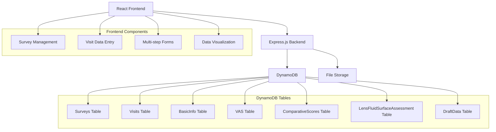
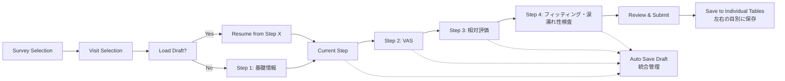

# 眼科サーベイシステム Design Document - Phase 1

## Overview

眼科サーベイシステムは、眼科臨床試験における検査データの効率的な収集と管理を目的としたWebアプリケーションです。フェーズ1では、シンプルなモノリシック構成でサーベイとVisitの基本機能に焦点を当て、既存のテーブル構造に基づいた検査データ入力システムを提供します。

## Architecture

フェーズ1では、シンプルなモノリシック構成を採用し、データストレージには全てDynamoDBを使用してコスト効率と運用の簡素化を実現します：



### Technology Stack
- **Frontend**: React 18 with TypeScript, Material-UI v5
- **Backend**: Node.js with Express.js, TypeScript
- **Database**: DynamoDB (single database solution)
- **File Storage**: Local file system (Phase 1), S3 for future phases
- **State Management**: React Context API + useReducer
- **Form Management**: React Hook Form with Zod validation
- **AWS SDK**: DynamoDB client for Node.js v3
- **Deployment**: Docker containers with docker-compose

### Database Strategy

**All-DynamoDB Benefits:**
- 統一されたデータアクセスパターン
- 自動スケーリングとサーバーレス対応
- 運用コストの削減（単一データベース）
- AWS環境での一貫性
- 将来のLambda移行への対応

**既存テーブル構造の活用:**
- 既存の4つの検査テーブル構造を維持
- 各テーブルは検査グループごとに独立
- DraftDataで統合された下書き管理

## Data Models

### DynamoDB Table Designs

#### 1. Surveys Table
```typescript
interface SurveyRecord {
  // Partition Key
  surveyId: string; // "survey-{timestamp}"
  
  // Attributes
  name: string;
  description?: string;
  isActive: boolean;
  createdAt: string; // ISO string
  updatedAt: string;
  createdBy?: string; // 将来の認証機能用
  
  // GSI for listing active surveys
  entityType: 'survey'; // GSI partition key
}
```

#### 2. Visits Table
```typescript
interface VisitRecord {
  // Partition Key
  surveyId: string;
  // Sort Key  
  visitId: string; // "visit-{visitNumber}-{timestamp}"
  
  // Attributes
  visitNumber: number;
  visitType: 'baseline' | '1week' | '1month' | '3month' | 'custom';
  scheduledDate?: string; // ISO string
  actualDate?: string;
  status: 'scheduled' | 'in_progress' | 'completed' | 'cancelled';
  
  // Metadata
  createdAt: string;
  updatedAt: string;
}
```

#### 3. BasicInfo Table (基礎情報)
```typescript
interface BasicInfoRecord {
  // Partition Key
  visitId: string;
  // Sort Key
  basicInfoId: string; // "basicinfo-{eyeSide}-{timestamp}"
  
  // Basic Information Data
  currentUsedCL: string; // 現在使用しているコンタクトレンズ
  
  // 角膜曲率半径
  cr_R1: number; // Integer
  cr_R2: number; // Integer
  cr_Ave: number; // Integer - 平均
  
  // 屈折検査
  va: number; // Float - 視力
  s: number; // Float - 球面度数
  c: number; // Float - 円柱度数
  ax: number; // Integer - 軸
  
  // 眼圧
  intraocularPressure1: number; // Integer
  intraocularPressure2: number; // Integer
  intraocularPressure3: number; // Integer
  
  // 角膜内皮細胞
  cornealEndothelialCells: number; // Integer
  
  // Metadata
  eyeSide: string; // 'right' | 'left'
  surveyId: string;
  createdAt: string;
  updatedAt: string;
}
```

#### 4. VAS Table (Visual Analog Scale)
```typescript
interface VASRecord {
  // Partition Key
  visitId: string;
  // Sort Key
  vasId: string; // "vas-{eyeSide}-{timestamp}"
  
  // VAS Data
  comfortLevel: number; // Integer
  drynessLevel: number; // Integer
  visualPerformance_Daytime: number; // Integer
  visualPerformance_EndOfDay: string;
  
  // Metadata
  eyeSide: string; // 'right' | 'left'
  surveyId: string;
  createdAt: string;
  updatedAt: string;
}
```

#### 5. ComparativeScores Table (相対評価)
```typescript
interface ComparativeScoresRecord {
  // Partition Key
  visitId: string;
  // Sort Key
  comparativeScoresId: string; // "comparative-{eyeSide}-{timestamp}"
  
  // Comparative Assessment Data
  comfort: string;
  comfortReason: string;
  dryness: string;
  drynessReason: string;
  
  // Visual Performance
  vp_DigitalDevice: string;
  vpReason_DigitalDevice: string;
  vp_DayTime: string;
  vpReason_DayTime: string;
  vp_EndOfDay: string;
  vpReason_EndOfDay: string;
  vp_Glare: string;
  vpReason_Glare: string;
  vp_Halo: string;
  vpReason_Halo: string;
  vp_StarBurst: string;
  vpReason_StarBurst: string;
  
  // Overall Assessment
  eyeStrain: string;
  eyeStrainReason: string;
  totalSatisfaction: string;
  totalSatisfactionReason: string;
  
  // Metadata
  eyeSide: string; // 'right' | 'left'
  surveyId: string;
  createdAt: string;
  updatedAt: string;
}
```

#### 6. LensFluidSurfaceAssessment Table (フィッティング検査・涙濡れ性検査)
```typescript
interface LensFluidSurfaceAssessmentRecord {
  // Partition Key
  visitId: string;
  // Sort Key
  fittingId: string; // "fitting-{eyeSide}-{timestamp}"
  
  // Fitting Assessment Data
  timing: string;
  lensMovement: number; // Float
  lensPosition: string;
  fittingPattern: string;
  lensWettability: string;
  surfaceDeposit: string;
  lensDryness: string;
  
  // FACE2 Assessment
  face2_X: number; // Float
  face2_Y: number; // Float
  
  // Metadata
  eyeSide: string; // 'right' | 'left'
  surveyId: string;
  createdAt: string;
  updatedAt: string;
}
```

#### 7. DraftData Table (統合下書き管理)
```typescript
interface DraftRecord {
  // Partition Key
  visitId: string;
  // Sort Key
  draftId: 'current'; // 固定値（常に最新の下書き）
  
  // 全検査グループの下書きデータを統合
  formData: {
    basicInfo?: {
      right?: Partial<BasicInfoRecord>;
      left?: Partial<BasicInfoRecord>;
    };
    vas?: {
      right?: Partial<VASRecord>;
      left?: Partial<VASRecord>;
    };
    comparativeScores?: {
      right?: Partial<ComparativeScoresRecord>;
      left?: Partial<ComparativeScoresRecord>;
    };
    lensFluidSurface?: {
      right?: Partial<LensFluidSurfaceAssessmentRecord>;
      left?: Partial<LensFluidSurfaceAssessmentRecord>;
    };
  };
  
  // フォーム進捗管理
  currentStep: number; // 現在のステップ (1-4)
  completedSteps: number[]; // 完了済みステップ
  
  // Metadata
  lastSaved: string;
  autoSaved: boolean;
  
  // TTL for automatic cleanup
  ttl: number; // Unix timestamp (30 days from creation)
}
```

## Database Access Layer

### Repository Pattern Implementation
```typescript
import { DynamoDBClient } from '@aws-sdk/client-dynamodb';
import { DynamoDBDocumentClient, PutCommand, GetCommand, QueryCommand, UpdateCommand, BatchWriteCommand } from '@aws-sdk/lib-dynamodb';

class DynamoDBRepository {
  protected docClient: DynamoDBDocumentClient;
  
  constructor() {
    const client = new DynamoDBClient({
      region: process.env.AWS_REGION || 'ap-northeast-1'
    });
    this.docClient = DynamoDBDocumentClient.from(client);
  }
}

class BasicInfoRepository extends DynamoDBRepository {
  async save(visitId: string, eyeSide: string, data: Partial<BasicInfoRecord>): Promise<void> {
    const record: BasicInfoRecord = {
      visitId,
      basicInfoId: `basicinfo-${eyeSide}-${Date.now()}`,
      eyeSide,
      surveyId: data.surveyId!,
      ...data,
      createdAt: new Date().toISOString(),
      updatedAt: new Date().toISOString()
    } as BasicInfoRecord;
    
    await this.docClient.send(new PutCommand({
      TableName: 'BasicInfo',
      Item: record
    }));
  }
  
  async findByVisitId(visitId: string): Promise<BasicInfoRecord[]> {
    const result = await this.docClient.send(new QueryCommand({
      TableName: 'BasicInfo',
      KeyConditionExpression: 'visitId = :visitId',
      ExpressionAttributeValues: {
        ':visitId': visitId
      }
    }));
    
    return result.Items as BasicInfoRecord[];
  }
}

class VASRepository extends DynamoDBRepository {
  async save(visitId: string, eyeSide: string, data: Partial<VASRecord>): Promise<void> {
    const record: VASRecord = {
      visitId,
      vasId: `vas-${eyeSide}-${Date.now()}`,
      eyeSide,
      surveyId: data.surveyId!,
      ...data,
      createdAt: new Date().toISOString(),
      updatedAt: new Date().toISOString()
    } as VASRecord;
    
    await this.docClient.send(new PutCommand({
      TableName: 'VAS',
      Item: record
    }));
  }
  
  async findByVisitId(visitId: string): Promise<VASRecord[]> {
    const result = await this.docClient.send(new QueryCommand({
      TableName: 'VAS',
      KeyConditionExpression: 'visitId = :visitId',
      ExpressionAttributeValues: {
        ':visitId': visitId
      }
    }));
    
    return result.Items as VASRecord[];
  }
}

class ComparativeScoresRepository extends DynamoDBRepository {
  async save(visitId: string, eyeSide: string, data: Partial<ComparativeScoresRecord>): Promise<void> {
    const record: ComparativeScoresRecord = {
      visitId,
      comparativeScoresId: `comparative-${eyeSide}-${Date.now()}`,
      eyeSide,
      surveyId: data.surveyId!,
      ...data,
      createdAt: new Date().toISOString(),
      updatedAt: new Date().toISOString()
    } as ComparativeScoresRecord;
    
    await this.docClient.send(new PutCommand({
      TableName: 'ComparativeScores',
      Item: record
    }));
  }
  
  async findByVisitId(visitId: string): Promise<ComparativeScoresRecord[]> {
    const result = await this.docClient.send(new QueryCommand({
      TableName: 'ComparativeScores',
      KeyConditionExpression: 'visitId = :visitId',
      ExpressionAttributeValues: {
        ':visitId': visitId
      }
    }));
    
    return result.Items as ComparativeScoresRecord[];
  }
}

class LensFluidSurfaceAssessmentRepository extends DynamoDBRepository {
  async save(visitId: string, eyeSide: string, data: Partial<LensFluidSurfaceAssessmentRecord>): Promise<void> {
    const record: LensFluidSurfaceAssessmentRecord = {
      visitId,
      fittingId: `fitting-${eyeSide}-${Date.now()}`,
      eyeSide,
      surveyId: data.surveyId!,
      ...data,
      createdAt: new Date().toISOString(),
      updatedAt: new Date().toISOString()
    } as LensFluidSurfaceAssessmentRecord;
    
    await this.docClient.send(new PutCommand({
      TableName: 'LensFluidSurfaceAssessment',
      Item: record
    }));
  }
  
  async findByVisitId(visitId: string): Promise<LensFluidSurfaceAssessmentRecord[]> {
    const result = await this.docClient.send(new QueryCommand({
      TableName: 'LensFluidSurfaceAssessment',
      KeyConditionExpression: 'visitId = :visitId',
      ExpressionAttributeValues: {
        ':visitId': visitId
      }
    }));
    
    return result.Items as LensFluidSurfaceAssessmentRecord[];
  }
}

class DraftDataRepository extends DynamoDBRepository {
  async saveDraft(visitId: string, formData: any, currentStep: number, completedSteps: number[]): Promise<void> {
    const draftRecord: DraftRecord = {
      visitId,
      draftId: 'current',
      formData,
      currentStep,
      completedSteps,
      lastSaved: new Date().toISOString(),
      autoSaved: true,
      ttl: Math.floor(Date.now() / 1000) + (30 * 24 * 60 * 60) // 30 days
    };
    
    await this.docClient.send(new PutCommand({
      TableName: 'DraftData',
      Item: draftRecord
    }));
  }
  
  async getDraft(visitId: string): Promise<DraftRecord | null> {
    const result = await this.docClient.send(new GetCommand({
      TableName: 'DraftData',
      Key: {
        visitId,
        draftId: 'current'
      }
    }));
    
    return result.Item as DraftRecord || null;
  }
}
```

## Components and Interfaces

### 1. Survey Management Component
- **Purpose**: サーベイの作成、一覧表示、管理
- **Key Features**: サーベイメタデータ管理、Visit スケジュール設定
- **Data Storage**: DynamoDB Surveys Table
- **API Endpoints**:
  - `POST /api/surveys` - 新規サーベイ作成
  - `GET /api/surveys` - サーベイ一覧取得
  - `GET /api/surveys/:id` - 特定サーベイ詳細取得
  - `PUT /api/surveys/:id` - サーベイ更新

### 2. Visit Management Component
- **Purpose**: 時系列的な訪問データの管理
- **Key Features**: Visit スケジューリング、ステータス管理、進捗追跡
- **Data Storage**: DynamoDB Visits Table
- **API Endpoints**:
  - `POST /api/surveys/:surveyId/visits` - 新規Visit作成
  - `GET /api/surveys/:surveyId/visits` - Visit一覧取得
  - `GET /api/visits/:id` - 特定Visit詳細取得
  - `PUT /api/visits/:id/status` - Visitステータス更新

### 3. Examination Data Entry Component
- **Purpose**: 4つの検査グループのデータ入力
- **Key Features**: マルチステップフォーム、リアルタイム検証、下書き保存
- **Data Storage**: 各検査テーブル + DraftData Table
- **API Endpoints**:
  - `POST /api/visits/:visitId/basic-info` - 基礎情報保存
  - `POST /api/visits/:visitId/vas` - VAS データ保存
  - `POST /api/visits/:visitId/comparative-scores` - 相対評価保存
  - `POST /api/visits/:visitId/lens-fluid-surface` - フィッティング・涙濡れ性検査保存
  - `GET /api/visits/:visitId/examinations` - 全検査データ取得
  - `POST /api/visits/:visitId/draft` - 下書き保存
  - `GET /api/visits/:visitId/draft` - 下書き取得

### 4. Data Visualization Component
- **Purpose**: 入力されたデータの表示と比較
- **Key Features**: 読み取り専用表示、Visit間比較、左右の目の比較
- **Data Storage**: DynamoDB (複数テーブルからの集約)
- **API Endpoints**:
  - `GET /api/visits/:visitId/examinations/view` - 表示用データ取得
  - `GET /api/surveys/:surveyId/comparison` - Visit間比較データ取得

## User Experience Design

### Multi-step Form Flow with Draft Management


### Key UX Features
- **4-Step Process**: 基礎情報 → VAS → 相対評価 → フィッティング・涙濡れ性検査
- **Left/Right Eye Management**: 各ステップで左右の目のデータを個別管理
- **Smart Draft Management**: 統合された下書きデータで中断・再開が自然
- **Progressive Disclosure**: 各ステップで関連する検査項目のみ表示
- **Visual Progress Indicator**: 現在のステップと全体の進捗を明確に表示
- **Contextual Help**: 各検査項目に説明とガイダンスを提供

## Cost Optimization Strategy

### DynamoDB Cost Management
- **On-Demand Billing**: 開発・テスト段階での予測可能なコスト
- **Efficient Key Design**: 
  - 各テーブル: visitId + 固有ID で効率的なアクセス
  - DraftData: visitId + 'current' で単純なアクセス
- **TTL設定**: 下書きデータの自動削除でストレージコスト削減
- **Batch Operations**: 左右の目のデータ一括保存でコスト削減

### Query Optimization
- **Visit-based Access**: visitId をパーティションキーとして効率的なデータ取得
- **Eye-side Separation**: 左右の目のデータを個別レコードで管理
- **Draft Consolidation**: 1つのレコードで全下書きデータを管理

## Testing Strategy

### Database Testing
- **DynamoDB Local**: ローカル開発とテスト用
- **Test Data Fixtures**: 各検査テーブルの現実的なテストデータ
- **Integration Testing**: 複数テーブル間の連携テスト
- **Performance Testing**: 大量の検査データでのクエリパフォーマンス検証

### Form Testing
- **Multi-step Flow Testing**: 4ステップのフォーム遷移テスト
- **Draft Save/Restore Testing**: 下書き保存・復元機能のテスト
- **Left/Right Eye Data Testing**: 左右の目のデータ管理テスト
- **Validation Testing**: 各検査項目の入力検証テスト

この設計により、既存のテーブル構造を活用しつつ、効率的な眼科サーベイシステムを構築できます。